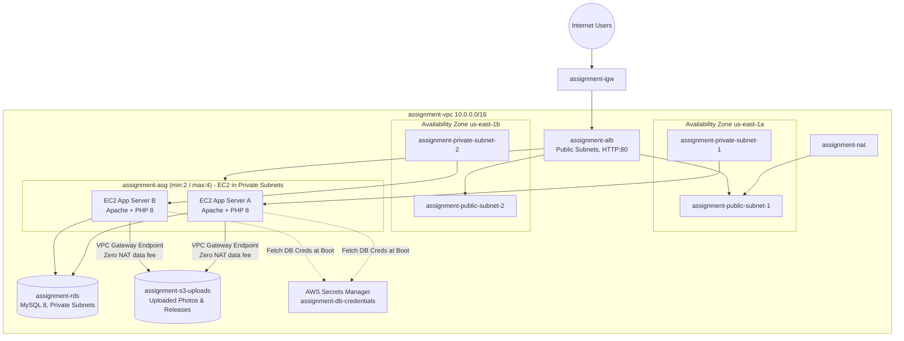

# Campus Shuttle Bus & Transport Ticketing Platform

A cloud-native PHP + MySQL web platform and AWS Terraform infrastructure designed for the **AMIT3253 Cloud Computing for Business** capstone project at TAR UMT. 

Students browse campus shuttle routes, view real-time seat availability, and book tickets for specific travel dates with concurrency-safe transaction locking. System administrators manage routes, tickets, user accounts, and track ridership metrics through an administrative operations dashboard.

---

## 1. System Architecture



### Security & High Availability Highlights
- **Multi-AZ Resilience**: Subnets span `us-east-1a` and `us-east-1b`. The ALB distributes incoming requests across healthy EC2 instances in both zones.
- **Private Subnet Isolation**: EC2 instances and RDS MySQL have **no public IPv4 addresses**. Inbound traffic is accepted only via layered security groups:
  `Internet -> ALB (port 80) -> EC2 (port 80) -> RDS MySQL (port 3306)`.
- **Stateless EC2 & Database Session Storage**: PHP session states are stored in the RDS `sessions` table (`DbSessionHandler`), allowing seamless user sessions across auto-scaled instances without requiring sticky sessions.
- **Zero-Downtime Code Delivery**: Deployments stage updates in `/tmp/` and atomically copy files to `/var/www/html/` before reloading Apache, preventing 404 gaps during deployments.
- **Fail-Fast Health Checks**: Target group health checks probe `/healthz.php` with a 3-second database connection timeout, failing fast and pulling unhealthy nodes before request timeouts impact users.

---

## 2. Directory Structure

```
CCFB-shuttle-bus-system/
├── README.md                      # Project documentation and architecture guide
├── .github/workflows/             # Automated CI/CD Pipelines
│   ├── ci.yml                     # Unified pipeline entry point (plan, deploy, destroy)
│   ├── build.yml                  # Terraform syntax check, plan, apply, & destroy
│   ├── deploy.yml                 # Code build, PHP linting, S3 artifact upload, SSM dispatch
│   └── db-init.yml                # One-time automated RDS database seeding via SSM
├── infra/                         # Infrastructure as Code (Terraform 1.9)
│   ├── envs/sandbox/              # Main environment entry (backend, providers, variables)
│   ├── modules/                   # Reusable Terraform infrastructure modules
│   │   ├── alb/                   # Application Load Balancer & HTTP target groups
│   │   ├── asg/                   # Launch template, Auto Scaling Group & CPU target tracking
│   │   ├── rds/                   # Private MySQL RDS instance & DB subnet group
│   │   ├── s3/                    # S3 bucket for uploads & release artifacts
│   │   ├── secrets/               # Secrets Manager DB credentials & IAM policy
│   │   ├── security-groups/       # Security group chaining (ALB -> EC2 -> RDS)
│   │   └── vpc/                   # VPC, 4 subnets across 2 AZs, NAT Gateway, S3 VPC Endpoint
│   └── scripts/
│       └── seed-db.sh             # Idempotent database bootstrap script executed via SSM
└── shuttle-bus-ticketing/         # Web Application (PHP 8.x + MySQL)
    ├── config.php                 # Environment configuration, DB connection & S3 settings
    ├── auth.php                   # Database session handler, auth helpers, CSRF protection
    ├── helpers.php                # Photo upload validation, SigV4 S3 signer, timetable math
    ├── schema.sql                 # Database DDL & seed data (users, routes, tickets, sessions)
    ├── healthz.php                # ALB health check target with DB ping
    ├── index.php                  # Public homepage (search, route cards, My Tickets)
    ├── create.php / edit.php      # Concurrency-safe seat reservation with max 5 seats/order
    ├── delete.php                 # Ticket cancellation handler with CSRF verification
    ├── route_availability.php     # Asynchronous route capacity & departure JSON API
    ├── routes.php / schedule.php  # Public timetables and route information
    ├── testimonials.php           # Student reviews & ratings
    ├── contact.php                # Contact and feedback submission form
    └── admin/                     # Administrative Control Panel
        ├── index.php              # Operations Dashboard (revenue, tickets, occupancy analytics)
        ├── routes.php             # Route management & creation
        ├── tickets.php            # Master ticket registry & cancellations
        ├── users.php              # User role management (promote/demote admin, delete accounts)
        └── messages.php           # Contact messages inbox
```

---

## 3. Core Application Features

1. **Concurrency-Safe Seat Reservation**:
   - Booking uses pessimistic row locking (`SELECT ... FOR UPDATE`) within a database transaction.
   - Sums all seats currently booked for that route and date, strictly enforcing `routes.total_seats`.
   - Protects against booking monopoly with a 5-seat-per-booking cap.
2. **Real-Time Asynchronous Availability**:
   - The booking form queries `route_availability.php` dynamically when changing the travel date.
   - Fully booked routes or routes that have already departed today are disabled and greyed out before submission.
3. **Security Hardening**:
   - **CSRF Protection**: All POST actions (booking, editing, canceling, user management, and reviews) enforce cryptographic anti-CSRF tokens (`csrf_token()` / `verify_csrf()`).
   - **Session Hardening**: Sessions enforce `HttpOnly`, `SameSite=Lax`, and regenerate session identifiers on login (`session_regenerate_id()`) to prevent session fixation attacks.
   - **SQL Injection Prevention**: All queries use prepared statements with parameter binding.
4. **Admin Analytics Dashboard (`admin/index.php`)**:
   - KPI metrics: Total Revenue (RM), Total Tickets Sold, Today's Bookings & Occupancy, Registered Accounts.
   - Ridership breakdown by route and recent activity feed.

---

## 4. Local Development Setup

### Requirements
- PHP 8.1+ with `mysqli` extension
- MySQL 5.7+ / MariaDB 10.5+

### Quickstart
1. **Clone the repository and enter the app folder**:
   ```bash
   cd shuttle-bus-ticketing
   ```
2. **Initialize the local database**:
   ```bash
   mysql -u root -p -e "CREATE DATABASE shuttle_bus_db;"
   mysql -u root -p shuttle_bus_db < schema.sql
   ```
3. **Configure Environment Variables**:
   Copy `.env.example` to `.env` and fill in your local MySQL credentials:
   ```bash
   cp .env.example .env
   ```
   ```ini
   DB_HOST=localhost
   DB_USER=root
   DB_PASS=yourpassword
   DB_NAME=shuttle_bus_db
   ```
4. **Start the local PHP server**:
   ```bash
   php -S localhost:8000
   ```
5. **Access the application**:
   - Public site: `http://localhost:8000/`
   - Default Admin: `admin@example.com` / `admin123` *(change password upon deployment)*

---

## 5. AWS Cloud Deployment (Terraform + GitHub Actions)

Deployments are automated through **GitHub Actions** and provisioned via **Terraform** in the `us-east-1` region.

### Prerequisites (AWS Academy Learner Lab)
1. **Bootstrap the remote Terraform state bucket & lock table** (one-time setup via AWS CLI):
   ```bash
   ACCOUNT_ID=$(aws sts get-caller-identity --query Account --output text)
   aws s3api create-bucket --bucket "shuttle-bus-ticketing-tfstate-${ACCOUNT_ID}" --region us-east-1
   aws dynamodb create-table --table-name "shuttle-bus-ticketing-tf-lock" \
     --attribute-definitions AttributeName=LockID,AttributeType=S \
     --key-schema AttributeName=LockID,KeyType=HASH \
     --billing-mode PAY_PER_REQUEST
   ```
2. **Set GitHub Repository Secrets**:
   Learner Lab credentials rotate periodically. Before triggering workflows, ensure the following 3 secrets are updated in GitHub Settings &rarr; Secrets:
   - `AWS_ACCESS_KEY_ID`
   - `AWS_SECRET_ACCESS_KEY`
   - `AWS_SESSION_TOKEN`

### CI/CD Workflows

| Workflow | File | Trigger | Purpose |
|---|---|---|---|
| **CI - Full Pipeline** | `.github/workflows/ci.yml` | Manual (`workflow_dispatch`) | Single entry point. Mode `plan`/`destroy` controls infra; `deploy` provisions infra then deploys the app. |
| **CI - Build Infrastructure** | `.github/workflows/build.yml` | Reusable / Manual | Formats, validates, and runs `terraform plan`, `apply`, or `destroy`. |
| **CD - Deploy Application** | `.github/workflows/deploy.yml` | Reusable / Manual | Validates PHP syntax, builds artifact, uploads to S3, and updates EC2 fleet via SSM without downtime. |
| **DB - Seed Database** | `.github/workflows/db-init.yml` | Manual (one-time) | Idempotently seeds `schema.sql` into private RDS instance via SSM Run Command on an EC2 instance. |

### Deployment Steps
1. Navigate to the **Actions** tab in GitHub.
2. Select **CI - Full Pipeline** &rarr; **Run workflow** with `mode: deploy`.
3. After the pipeline finishes and EC2 instances are healthy, run **DB - Seed Database** once to populate the sample routes and default admin account.
4. Access the web app using the Application Load Balancer DNS name printed in the Terraform outputs (`alb_dns_name`).
5. When finished testing, run **CI - Full Pipeline** with `mode: destroy` to terminate all AWS resources and stay within budget.
